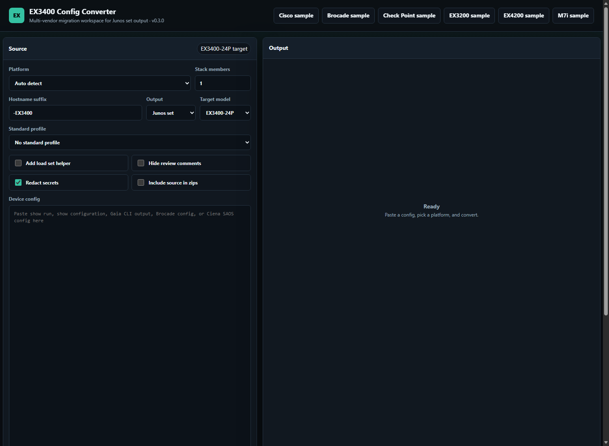
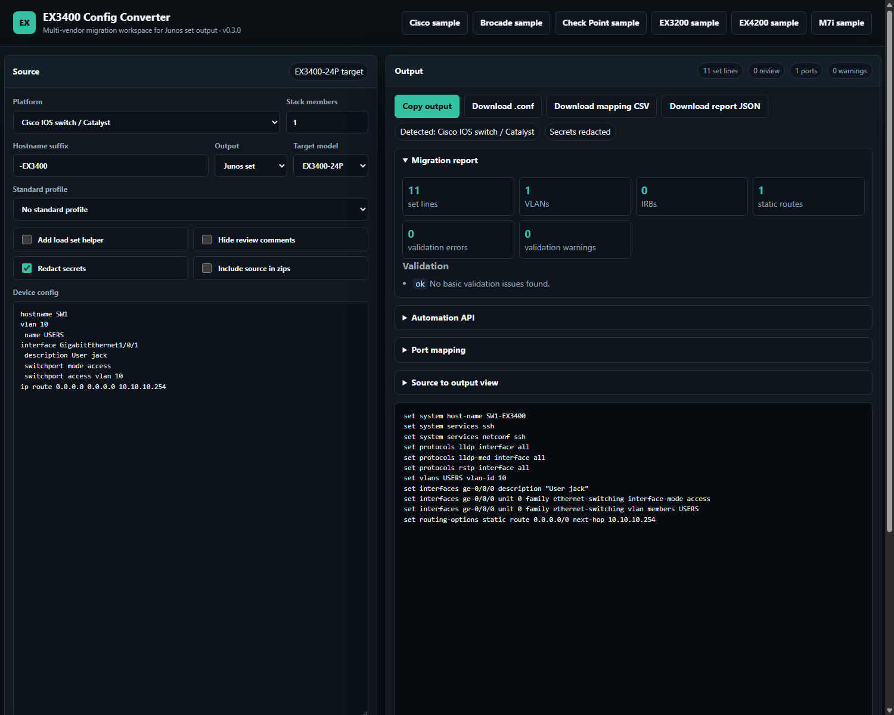

# Config_Converter_to_Ex3400 User Manual

Config_Converter_to_Ex3400 is a local web app and CLI tool for converting legacy network device configurations into Juniper EX3400-oriented Junos `set` commands. It is designed as a migration assistant: it converts common Layer 2, Layer 3, management, and protocol settings, and it flags anything that needs engineering review.

## Screenshots

### Main Workspace



### Converted Output, Report, and Export Controls



## What The App Does

- Converts pasted or uploaded configs into EX3400 Junos `set` commands.
- Supports single-device conversion and batch conversion.
- Produces migration reports, validation findings, warning categories, and port mappings.
- Redacts secrets by default before showing or exporting generated configs.
- Exports `.conf`, CSV, JSON report, and full project zip bundles.
- Provides JSON API endpoints for automation workflows.

## Supported Source Platforms

- Cisco IOS switch / Catalyst
- Cisco Catalyst 6500
- Check Point Gaia
- Brocade / Ruckus ICX
- Juniper EX3200
- Juniper EX3300
- Juniper EX4200
- Juniper EX4500
- Juniper M7i
- Juniper MX104
- Ciena 3920/3930 SAOS
- Auto-detect mode for common patterns

## Supported Targets

- EX3400-24P
- EX3400-48 port
- EX3400-24P stack

The target model affects automatic port assignment. For example, EX4200 port `ge-0/0/24` maps to `ge-1/0/0` when targeting an EX3400-24P stack.

## Install And Run On Windows

1. Clone or download the repository.
2. Double-click `Launch_Config_Convert_App.bat`.
3. Open `http://127.0.0.1:5050` if the browser does not open automatically.

Manual Windows run:

```powershell
python -m pip install -r requirements.txt
python app.py
```

## Install And Run On WSL / Linux

From the project directory:

```bash
chmod +x install_wsl_prereqs.sh run_wsl.sh
./install_wsl_prereqs.sh
./run_wsl.sh
```

Then open this from Windows or Linux:

```text
http://127.0.0.1:5050
```

If prerequisites are already installed:

```bash
chmod +x run_wsl.sh
./run_wsl.sh
```

If virtual environments are not available and you intentionally want to use the user/global Python environment:

```bash
chmod +x run_wsl_no_venv.sh
./run_wsl_no_venv.sh
```

## Run With Docker

```bash
docker compose up --build
```

Then open:

```text
http://127.0.0.1:5050
```

## Basic Conversion Workflow

1. Paste the source device config into **Device config**.
2. Select the **Platform**, or leave it on **Auto detect**.
3. Pick the **Target model**.
4. Set **Stack members** if the target is a stack.
5. Keep **Redact secrets** enabled unless you intentionally need secrets preserved.
6. Click **Convert**.
7. Review warnings, validation results, and the generated `set` commands.
8. Use **Copy output**, **Download .conf**, **Download mapping CSV**, or **Download report JSON**.

## Sample Buttons

The sample buttons populate safe demo configs:

- Cisco sample
- Brocade sample
- Check Point sample
- EX3200 sample
- EX4200 sample
- M7i sample

These are useful for verifying the app after install or demonstrating expected output.

## Standard Profiles

The **Standard profile** control can inject common baseline settings into the generated output.

Available profiles:

- **No standard profile**: no extra baseline lines.
- **Basic ops baseline**: SSH, LLDP, RSTP, and basic syslog file settings.
- **Field turn-up baseline**: common field turn-up placeholders for SSH, LLDP, RSTP, NTP, SNMP location, and contact.

Review placeholder values like `<ntp-server>` before using the output.

## Port Overrides

Use **Port overrides** when automatic assignment is not what you want.

Accepted formats:

```text
GigabitEthernet1/0/1 = ge-0/0/10
GigabitEthernet1/0/2 -> ge-0/0/11
GigabitEthernet1/0/3, ge-0/0/12
```

If a source port is not present in the generated mapping, the app adds a warning instead of silently changing nothing.

## Secret Redaction

Secret redaction is enabled by default. The app masks values such as:

- SNMP communities
- BGP authentication keys
- Passwords
- Shared secrets
- RADIUS/TACACS keys

Turn redaction off only when you intentionally need generated output to preserve source secrets. Be careful when exporting project zips with source configs included.

## Validation Findings

The app performs basic validation on generated output, including:

- Duplicate `set` lines
- VLAN members without matching VLAN definitions
- IRB interfaces without VLAN `l3-interface` bindings
- Multiple source ports mapped to one target port
- Trunk ports without VLAN members

Validation findings are not a substitute for `commit check`; they are preflight checks to catch common migration mistakes.

## Migration Report

The migration report includes:

- Set line count
- VLAN count
- IRB count
- Static route count
- OSPF interface count
- Validation warning/error counts
- Review categories
- Port mapping

Download it with **Download report JSON** or as part of a project/batch zip.

## Review Categories

Warnings and review comments are grouped into categories:

- Chassis / hardware
- Routing protocols
- QoS / CoS
- Security / services
- Ring protection
- Management
- Interfaces
- Other

This helps separate normal review noise from items that need network design decisions.

## Batch Conversion

Use **Batch Convert** to upload multiple config files at once.

The zip output contains:

- `converted_ex3400.conf`
- `port_mapping.csv`
- `migration_report.json`
- `batch_index.json`
- `source_config.txt` only if **Include source in zips** is selected

By default, source configs are not included in zip exports.

## Project Zip Export

Use **Download project zip** after a single conversion to export:

- Converted config
- Port mapping CSV
- Migration report JSON
- Manifest JSON
- Optional source config

This is the best artifact for keeping a migration record per device.

## CLI Usage

```bash
python3 converter.py old_switch.txt --platform cisco_ios --stack-members 2 --target-model ex3400_24p_stack --output converted_ex3400.conf
```

Useful platform values:

```text
auto
cisco_ios
cisco_6500
checkpoint
brocade
juniper_ex3200
juniper_ex3300
juniper_ex4200
juniper_ex4500
juniper_m7i
juniper_mx104
ciena
```

Useful target values:

```text
ex3400_24p
ex3400_48
ex3400_24p_stack
```

## API Usage

List supported platforms, targets, and profiles:

```bash
curl http://127.0.0.1:5050/api/platforms
```

Convert a config:

```bash
curl -X POST http://127.0.0.1:5050/api/convert \
  -H "Content-Type: application/json" \
  -d '{"platform":"cisco_ios","source_config":"hostname SW1\n","redact_secrets":true}'
```

Get validation/report output:

```bash
curl -X POST http://127.0.0.1:5050/api/validate \
  -H "Content-Type: application/json" \
  -d '{"platform":"cisco_ios","source_config":"hostname SW1\n"}'
```

## Safety Notes

- This is a migration assistant, not a blind paste-and-commit tool.
- Always review warnings and validation findings.
- Always run a Junos `commit check` before production commit.
- Ciena ring protection, MX/M/M7i routing features, Check Point security policy, VPN, NAT, firewall policy, and platform-specific chassis features need design review.
- Keep **Redact secrets** enabled when sharing screenshots, reports, or zip bundles.

## Troubleshooting

### WSL says `python3-venv` or `pip` is missing

Run:

```bash
./install_wsl_prereqs.sh
```

### Browser cannot reach the app from Windows when running in WSL

The WSL launcher binds to `0.0.0.0` and prints:

```text
Open: http://127.0.0.1:5050
```

If it still fails, check whether another app is using port `5050`.

### Port 5050 is already in use

Run with a different port:

```bash
CONFIG_CONVERT_PORT=5051 ./run_wsl.sh
```

Then open:

```text
http://127.0.0.1:5051
```

### Windows launcher opens but app does not start

Run from PowerShell to see the error:

```powershell
.\Launch_Config_Convert_App.bat
```

### Generated output contains review comments

Review comments are intentional. They mark source behavior that cannot be safely translated without human review. Use **Hide review comments** only when you need a cleaner output view.

## Development

Install development dependencies:

```bash
python -m pip install -r requirements-dev.txt
```

Run tests:

```bash
python -m pytest
```

Compile check:

```bash
python -m py_compile app.py converter.py services.py
```

GitHub Actions runs tests and compile checks automatically on push and pull request.
